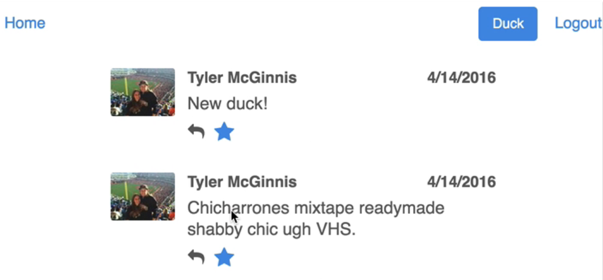
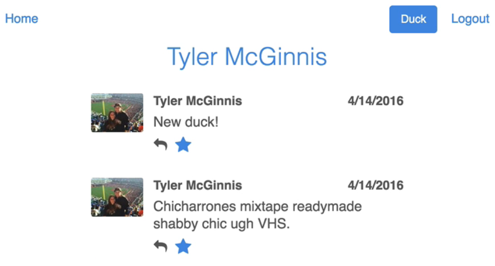
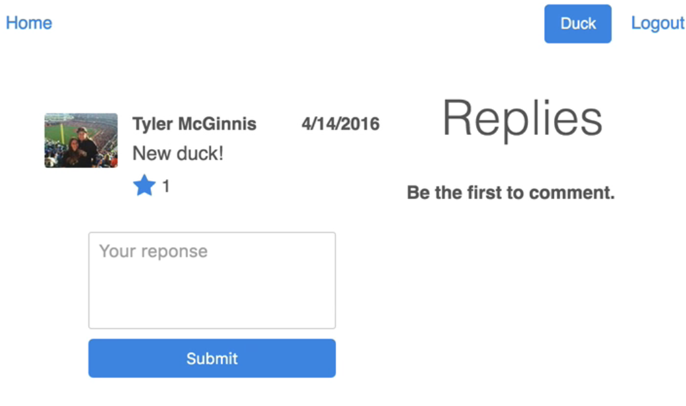

	Home
	.....All Ducks

 

	Profile
	.....UserInfo
	.....Users Ducks

 

	Replies
	.....Specific Duck
	.....Ducks Replies

 

**对应的数据结构设计思路一：**

	/users
		uid
			ducks
				duckId
					replies
						replyId
							uid
							name
							comment
							etc
					info
						uid
						avatar
						text
						numberOfLikes
						etc
			likes
				duckId
	/ducks
		duckId
			replies
				replayId
					name
					comment
					etc
			info
				uid
				avatar
				text
				etc
			likes
				uid

 

 

**对应的数据结构设计思路二：**

	/users
		uid
			info
		ducks
			duckId
				replies
				info
				usersWhoHaveLiked
		likes
			duckId
	/ducks
		duckId
			replies
			info
 

**对应的数据结构设计思路三：**

 

	/users
		uid
			name
			uid
			avatar
	/duckes
		duckId
			avatar
			duckId
			name
			text
			timestamp
			uid
	/likeCount
		duckId
	/replies
		duckId
			replayId
				name
				comment
				uid
				timestamp
				avatar
	/userLikes
		uid
			duckId