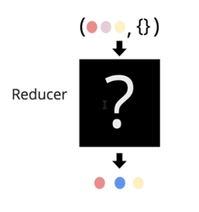

**什么是Reducer?**

以上`{}`表示action,点表示状态。Reducer的工作就是根据action来更新状态。

 

**什么是Action?**

	{
		type: AUTH_USER,
		uid
	}
以上，Action就是一个对象，包含一个type属性，type属性值告诉Reducer要做什么样的一个transformation。Action就是一个操作意图，传递给Reducer。

 

**Action设计**

	{
		type: AUTH_USER,
		uid
	}

	{
		type: UNAUTH_USER
	}

	{
		type: FETCHING_USER
	}

	{
		type: FETCHING_USER_FAILURE,
		error: 'Error fetching user'
	}

	{
		type: FETCHING_USER_SUCCESS,
		uid,
		user,
		timestamp
	}

	//Ducks
	{
		type: FETCHING_DUCK
	}

	{
		type: FETCHING_DUCK_ERROR,
		error: 'Error fetching duck'
	}

	{
		type: FETCHING_DUCK_SUCCESS,
		duck,
	}

	{
		type: REMOVE_FETCHING
	}

	{
		type: ADD_DUCK,
		duck,
	}

	{

		type: ADD_MULTIPLE_DUCKS,
		ducks
	}

	//Feed

	{
		type: SETTING_FEED_LISTENER
	}

	{
		type: SETTING_FEED_LISTENER_ERROR,
		error: 'Error fetching feeds'
	}

	{
		type: SETTING_FEED_LISTENER_SUCCESS,
		duckIds,
	}

	{
		type: ADD_NEW_DUCK_ID_TO_FEED,
		duckId
	}

	{
		type: RESET_NEWS_DUCKS_AVAILABLE
	}

	//listeners

	{
		type: ADD_LISTENER,
		listenerId
	}

	//Modal
	{
		type: OPEN_MODAL
	}

	{
		type: CLOSE_MODAL
	}	

	{
		type: UPDATE_DUCK_TEXT,
		newDuckText
	}

	{
		type: FETCHING_REPLIES
	}

	{
		type: FETCHING_REPLIES_ERROR,
		error: 'Error fetching replies'
	}

	{
		type: FETCHING_REPLIES_SUCCESS,
		replies,
		duckId,
		lastUpdate: Date.now(),
	}

	{
		type: ADD_REPLY,
		duckId,
		reply
	}

	{
		type: ADD_REPLY_ERROR,
		error: 'Error adding reply'
	}

	{
		type: REMOVE_REPLY,
		replyId,
	}

	{
		type: FETCHING_COUNT
	}

	{
		type: FETCHING_COUNT_ERROR,
		error: 'Error fetching duck\'s like count'
	}

	{
		type: FETCHING_COUNT_SUCCESS,
		duckId,
		count
	}

	{
		type: FETCHING_USERS_DUCKS,
		uid
	}

	{
		type: FETCHING_SUERS_DUCKS_ERROR,
		error: 'Error fetching users duck Ids'
	}

	{
		type: FETCHING_USERS_DUCKS_SUCCESS,
		uid,
		duckIds,
		lastUpdated,
	}

	{
		type: ADD_SINGLE_USERS_DUCK,
		uid,
		duckIds,
		lastUpdated
	}

	{
		type: FETCHING_LIKES
	}

	{
		type: FETCHING_LIKES_ERROR,
		error: 'Error fetching likes'
	}

	{
		type: FETCHING_LIKES_SUCCESS,
		likes
	}

	{
		type: ADD_LIKE,
		duckId
	}

	{
		type: REMOVE_LIKE,
		duckId
	}
	