当我们进行团队开发的时候，有一个统一的标准是有必要的。http://standardjs.com/ 这个网站就提供了这样的一套标准。

 

为此，安装如下：
> npm install --save-dev eslint eslint-{config-standard,plugin-standard,plugin-promise}

 

> 在根目录下创建.eslintrc

 

eslint在进行语法检查的时候会找到这个.eslintrc这个文件。

	{
	    extends: ["standard"]
	}

 

我们可以通过运行node命令来运行eslint的进行语法检查
> package.json

 

	  "scripts": {
	    "start": "webpack-dev-server",
	    "production": "webpack -p",
	    "lint": "eslint app/."
	  },

 

> npm run lint

 

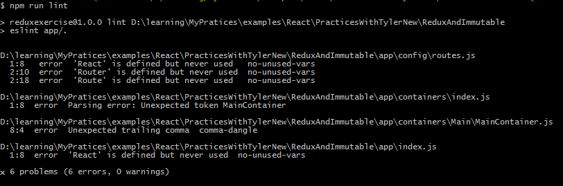
以上，通过eslint语法检查发现了错误。我们发现：在routes.js中有报错，说是React定义了但没有被使用。但实际上，路由中隐式用到了React。

 

接下来的问题是：我们希望eslint能读懂react

> npm install --save-dev eslint-plugin-react

 

装完以后，我们还得配置上
> .eslintrc

 

	{
	    extends: ["eslint:recommended", "plugin:react/recommended", "standard"],
	    plugins: [
	        "react"
	    ]
	}
 

> npm run lint

 
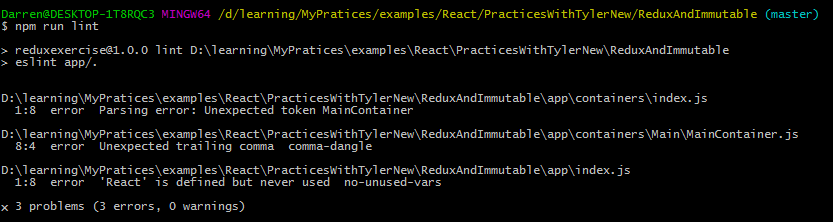
错误变得更少了。另外，在app/index.js中确实没有用到React，我们看看把React去除掉，是否会报错。
 

> app/index.js

 

	import ReactDOM from 'react-dom'
	import routes from './config/routes'
	
	ReactDOM.render(
	    routes,
	    document.getElementById('app')
	)

 

> npm run lint

 
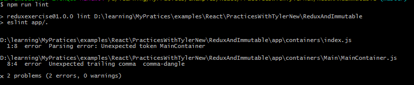
错误再次变得更少了。app/index.js中有关React的报错也没有了。

 

eslint还有一个命令，可以忽略逗号之类的语法检查
> package.json

 

	  "scripts": {
	    "start": "webpack-dev-server",
	    "production": "webpack -p",
	    "lint": "eslint app/.",
	    "fix": "eslint --fix app/."
	  },

 

> npm run fix

 
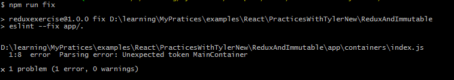
我们发现：错误再次更少了，有关逗号等的语法检查忽略了。另外，MainContainer是不合法的，而MainContainer是从app/containers/index.js中导出的。
 

> app/containers/index.js

 

	export { default as MainContainer } from './Main/MainContainer'

 

> npm run lint

 
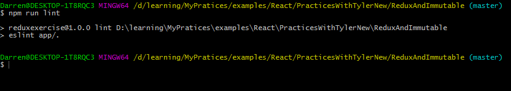
现在，已经没有报错了。

 

但，app/containers/index.js现在的这种写法不是很好。我们还是想写成：

	export MainContainer from './Main/MainContainer'

 

> app/containers/index.js

 

	export MainContainer from './Main/MainContainer'

 

为此，我们要装如下的这个package:

> npm install --save-dev babel-eslint@next

 

不过，装完后，还需要在.eslintrc文件中进行设置：

> .eslintrc

 

	{
	    parser: "babel-eslint",
	    extends: ["eslint:recommended", "plugin:react/recommended", "standard"],
	    plugins: [
	        "react"
	    ]
	}

 

> npm run lint

 

现在，同样没有报错了。

 

然后，视频中对.eslintrc文件进行了如下修改，就完全不知所云了。

> .eslintrc

 

	{
	    parser: "babel-eslint",
	    env: {
	        es6: true,
	        browser: true
	    },
	    parserOptions: {
	        ecmaversion: 6,
	        sourceType: "module",
	        ecmaFeatures:{
	            jsx: true,
	            experimentalObjectRestSpread: true
	        }
	    },
	    extends: ["eslint:recommended", "plugin:react/recommended", "standard"],
	    plugins: [
	        "react"
	    ],
	    "rules": {
	    "no-console": [2, {allow: ["warn", "error"]}],
	    "comma-dangle" : [2, "always-multiline"],
	    "semi": [2, "never"],
	    "no-extra-semi": 2,
	    "jsx-quotes": [2, "prefer-single"],
	    "react/jsx-boolean-value": [2, "always"],
	    "react/jsx-closing-bracket-location": [2, {selfClosing: "after-props", nonEmpty: "after-props"}],
	    "react/jsx-curly-spacing": [2, "never", {"allowMultiline": false}],
	    "react/jsx-max-props-per-line": [2, {maximum: 3}],
	    "react/jsx-no-literals": 2,
	    "react/self-closing-comp": 2,
	    "react/sort-comp": 2
	  },
	}

 

> npm run lint

 
又出现报错了：

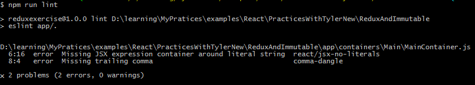
what's the hell is going on? 出错，不出错了，又出错？但从报错上来看，app/containes/Main/MainContainer.js中的写法有问题了。

 

> app/containes/Main/MainContainer.js

 

	import React from 'react'
	
	const MainContainer = React.createClass({
	  render () {
	    return (
	            
{'Hello World!'}

	        )
	  },
	})
	
	export default MainContainer

 

> npm run lint

 
没有报错。

 

> npm run start

 

> localhost:8080

 

页面也能正常显示。

 

接下来，又需要故意制造错误了。

> webpack.config.js

 

	var path = require('path')
	
	var HTMLWebpackPlugin = require('html-webpack-plugin')
	var HtmlWebpackPluginConfig = new HTMLWebpackPlugin({
	    template: __dirname + '/app/index.html',
	    filename: 'index.html',
	    inject: 'body'
	})
	
	var PATHS = {
	    app: path.join(__dirname, 'app'),
	    build: path.join(__dirname, 'dist'),
	}
	
	module.exports = {
	    entry:[
	        PATHS.app,
	    ],
	    output: {
	        path: PATHS.build,
	        filename: 'index_bundle.js'
	    },
	    module: {
	        loaders: [
	            {test:/\.js$/, exclude: /node_modules/, loader: 'babel-loader'},
	            {test:/\.css$/, loader: 'style-loader!css-loader'}
	        ]
	    },
	    plugins:[HtmlWebpackPluginConfig]
	}

 

> package.json

 

	  "main": "index.js",
	  "scripts": {
	    "start": "webpack-dev-server",
	    "production": "webpack -p",
	    "lint": "eslint app/.",
	    "fix": "eslint --fix app/."
	  },

 

> app/containers/Main/MainContainer.js

 

	import React from 'react'
	
	const MainContainer = React.createClass({
	  render () {
	    return (
	            
{'Hello World!'}

	        )
	  },
	})
	
	export default MainCntainer
以上，故意留了一个错误。

 

> localhost:8080

 

发现报错：
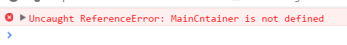
当点击报错的链接，在index_bundle.js文件中确实发现了错误，但具体哪个文件错了呢？很难追踪到。

 
在webpack.config.js中设置

> webpack.config.js

 

	module.exports = {
	    devtool: 'cheap-module-inline-source-map',
	    entry:[
	        PATHS.app,
	    ],

 

> npm run start

 

> localhost:8080

 
现在，可以定位到出错的文件和具体的错误了：
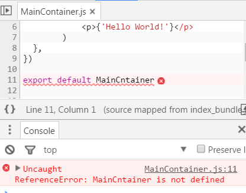

 

接下来，准备把dev和production分开。

 

当运行`npm run start`
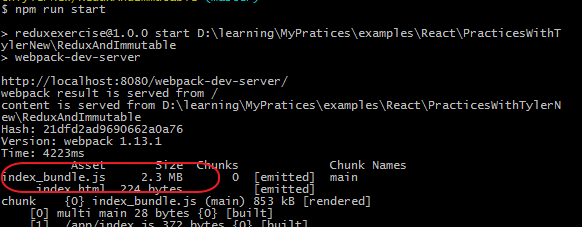
我们发现index_bundle.js的文件尺寸很大，达到了2.3M。

 

当运行`npm run production`
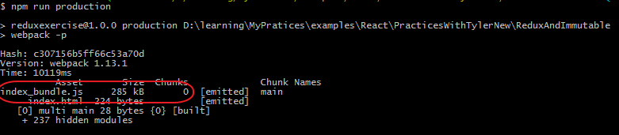
我们发现index_bundle.js的文件尺寸大大减少了。

 
index_bundle.js的文件尺寸还可以变得更小！

> webpack.config.js

 

	var path = require('path')
	var webpack = require('webpack')
	
	var HTMLWebpackPlugin = require('html-webpack-plugin')
	var HtmlWebpackPluginConfig = new HTMLWebpackPlugin({
	    template: __dirname + '/app/index.html',
	    filename: 'index.html',
	    inject: 'body'
	})
	
	var PATHS = {
	    app: path.join(__dirname, 'app'),
	    build: path.join(__dirname, 'dist'),
	}
	
	var LAUNCH_COMMAND = process.env.npm_lifecycle_event
	var isProduction = LAUNCH_COMMAND === 'production'
	
	var productionPlugin = new webpack.DefinePlugin({
	    'process.env': {
	        NODE_ENV: JSON.stringify('production')
	    }
	})
	
	var base = {
	    entry: [
	      PATHS.app,  
	    ],
	    output:{
	        path: PATHS.build,
	        filename: 'index_bundle.js',
	    },
	    module: {
	        loaders: [
	            {test:/\.js$/, exclude: /node_modules/, loader: 'babel-loader'},
	            {test:/\.css$/, loader: 'style-loader!css-loader'}
	        ]
	    },
	}
	
	var developmentConfig = {}
	
	var productionConfig = {}
	
	module.exports = {
	    devtool: 'cheap-module-inline-source-map',
	    entry:[
	        PATHS.app,
	    ],
	    output: {
	        path: PATHS.build,
	        filename: 'index_bundle.js'
	    },
	    module: {
	        loaders: [
	            {test:/\.js$/, exclude: /node_modules/, loader: 'babel-loader'},
	            {test:/\.css$/, loader: 'style-loader!css-loader'}
	        ]
	    },
	    plugins:[HtmlWebpackPluginConfig,productionPlugin]
	}

 

> npm run production

 
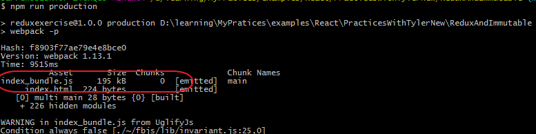
index_bundle.js的尺寸又变小了！

 

index_bundle.js的尺寸还可以变得更小！

> webpack.config.js

 

	module.exports = {
	    devtool: 'cheap-module-source-map',
	    entry:[
	        PATHS.app,
	    ],
 

> npm run production

 
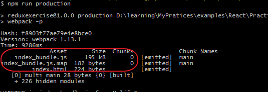
视频中说index_bundle.js可以变得更小，但我这里并没有看到，不过，多了一个index_bundle.js.map文件。

 
**现在，在webpack.config.js设置把dev和production分开。**

> 把webpack.config.js重命名为webpack.config.babel.js

 

> npm install --save-dev babel-preset-react-hmre

 

> webpack.config.babel.js

 

	import webpack from 'webpack'
	import path from 'path'
	import HtmlWebpackPlugin from 'html-webpack-plugin'
	
	const LAUNCH_COMMAND = process.env.npm_lifecycle_event
	
	const isProduction = LAUNCH_COMMAND === 'production'
	process.env.BABEL_ENV = LAUNCH_COMMAND
	
	const PATHS = {
	  app: path.join(__dirname, 'app'),
	  build: path.join(__dirname, 'dist'),
	}
	
	const HTMLWebpackPluginConfig = new HtmlWebpackPlugin({
	  template: PATHS.app + '/index.html',
	  filename: 'index.html',
	  inject: 'body'
	})
	
	const productionPlugin = new webpack.DefinePlugin({
	  'process.env': {
	    NODE_ENV: JSON.stringify('production')
	  }
	})
	
	const base = {
	  entry: [
	    PATHS.app
	  ],
	  output: {
	    path: PATHS.build,
	    filename: 'index_bundle.js'
	  },
	  module: {
	    loaders: [
	      {test: /\.js$/, exclude: /node_modules/, loader: 'babel-loader'},
	      {test: /\.css$/, loader: 'style!css?sourceMap&modules&localIdentName=[name]__[local]___[hash:base64:5]'}
	    ]
	  },
	  resolve: {
	    root: path.resolve('./app')
	  }
	}
	
	const developmentConfig = {
	  devtool: 'cheap-module-inline-source-map',
	  devServer: {
	    contentBase: PATHS.build,
	    hot: true,
	    inline: true,
	    progress: true,
	  },
	  plugins: [HTMLWebpackPluginConfig, new webpack.HotModuleReplacementPlugin()]
	}
	
	const productionConfig = {
	  devtool: 'cheap-module-source-map',
	  plugins: [HTMLWebpackPluginConfig, productionPlugin]
	}
	
	export default Object.assign({}, base, isProduction === true ? productionConfig : developmentConfig)

 

> .babelrc

 

	{
	    presets: [
	        'react',
	        'es2015',
	        'stage-0'
	    ],
	    env: {
	        start: {
	            presets: [
	                "react-hmre"
	            ]
	        }
	    }
	}

 

> app/containers/Main/MainContainer.js

 

	import React from 'react'
	
	const MainContainer = React.createClass({
	  render () {
	    return (
	            
{'Hello Worldd!'}

	        )
	  },
	})
	
	export default MainContainer

 

> npm run start

 
no problem

 

> npm run production

 

no problem

