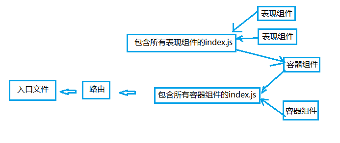

首先理顺一下big picure

首先是布局全局的一个容器组件

> app/containers/Main/MainController.js

 

	import React from 'react'
	
	const MainContainer = React.createClass({
	  render () {
	    return (
	            

	                {this.props.children}
	            

	        )
	  },
	})
	
	export default MainContainer

 

路由
> app/config/routes.js

 

	import React from 'react'
	import { Router, Route, hashHistory, IndexRoute } from 'react-router'
	import { MainContainer, HomeContainer } from '../containers'
	
	const routes = (
	    <Router history={hashHistory}>
	        <Route path='/' component={MainContainer}>
	            <IndexRoute component={HomeContainer} />
	        </Route>
	    </Router>
	)
	
	export default routes

 

在创建HomeController之前，首先是与之对应的表现组件

> app/components/Home/Home.js

 

	import React, { PropTypes } from 'react'
	
	export default function Home(props){
	    return (
	        
Home

	    )
	}

 
所有的表现组件，都被index.js管理
> app/components/index.js

 

	export Home from './Home/Home'

 
然后是与Home.js对应的容器组件
> app/containers/Home/HomeContainer.js

 

	import React from 'react'
	import { Home } from 'components'
	
	const HomeContainer = React.createClass({
	    render(){
	        return (
	            

	                <Home />    
	            

	        )
	    },
	})
	
	export default HomeContainer

 
所有的容器组件都被一个index.js管理
> app/containers/index.js

 

	export MainContainer from './Main/MainContainer'
	export HomeContainer from './Home/HomeContainer'

 

> npm run start

 

> localhost:8080

 

现在，首页套用一些样式。
> app/components/Home/styles.css

 

	.container{
	    display: flex;
	    justify-content: center;
	    align-items: center;
	    flex-direction: column;
	}
	
	.title{
	    color: #4a90e2;
	    font-weight: 100;
	    font-size: 100px;
	    margin-bottom: 20px;
	}
	
	.slogan{
	    color: #4a90e2;
	    font-size: 35px;
	    text-align: center;
	    line-height: 55px;
	    
	}

 

> app/components/Home/Home.js

 

	import React from 'react'
	import { container, title, slogan } from './styles.css'
	
	export default function Home () {
	  return (
	    

	      
{'Duckr'}

	      
{'The real time, cloud based, modular, scalable, growth hack, social platform. In the cloud.'}

	    

	  )
	}

 

> app/containers/Main/styles.css

 

	.container{
	    width: 100%;
	}
	
	.innerContainer{
	    max-width: 900px;
	    margin: 0 auto;
	}

 

> app/containers/Main/MainController

 

	import React from 'react'
	import { container, innerContainer } from './styles.css'
	
	const MainContainer = React.createClass({
	  render () {
	    return (
	      

	        

	          {this.props.children}
	        

	      

	    )
	  },
	})
	
	export default MainContainer

 

> localhost:8080

 

