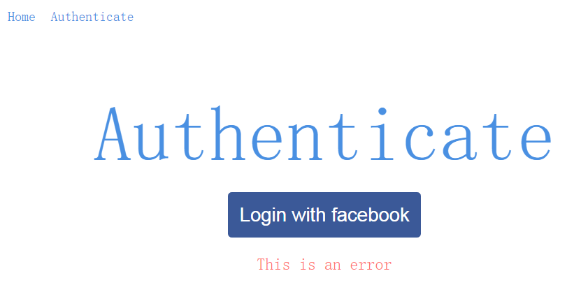

首先来到验证的表现组件。
> app/components/Authenticate/Authenticate.js

 

	import React, { PropTypes } from 'react'
	
	
	export default function Authenticate(props){
	    return (
	        
Authenticate

	    )
	}

 

表现组件通常被一个index.js文件管理。
> app/components/index.js

 

	export Home from './Home/Home'
	export Navigation from './Navigation/Navigation'
	export Authenticate from './Authenticate/Authenticate'

 

然后就来到了容器组件。
> app/containers/Authenticate/AuthenticateContainer.js

 

	import React from 'react'
	import { Authenticate } from 'components'
	
	const AuthenticateContainer = React.createClass({
	    render(){
	        return (
	            <Authenticate />
	        )
	    }
	})
	
	export default AuthenticateContainer

 

容器组件也是被一个index.js管理着。

> app/containers/index.js

 

	export MainContainer from './Main/MainContainer'
	export HomeContainer from './Home/HomeContainer'
	export AuthenticateContainer from './Authenticate/AuthenticateContainer'

 

接着就来到了路由。
> app/config/routes.js

 

	import React from 'react'
	import { Router, Route, hashHistory, IndexRoute } from 'react-router'
	import { MainContainer, HomeContainer, AuthenticateContainer } from '../containers'
	
	const routes = (
	    <Router history={hashHistory}>
	        <Route path='/' component={MainContainer}>
	            <Route path='auth' component={AuthenticateContainer} />
	            <IndexRoute component={HomeContainer} />
	        </Route>
	    </Router>
	)
	
	export default routes

 
最后是来到有关整体布局的MainContainer这个容器组价。
> app/containers/Main/MainContainer.js

 

	import React from 'react'
	import { container, innerContainer } from './styles.css'
	import { Navigation } from 'components'
	
	const MainContainer = React.createClass({
	  render () {
	    return (
	      

	        <Navigation isAuthed={false} />
	        

	          {this.props.children}
	        

	      

	    )
	  },
	})
	
	export default MainContainer

 

> npm run start

 

> localhost:8080

 

现在我们要做这样的一个效果：

初步分析，把Login with facebok做成一个表现组件，这个组件和上面的标题以及下面的标题组成另外一个表现组件。

 

首先是Login with facebook这个按钮的表现组件。

> app/components/FacebookAuthButton/FacebookAuthButton.js

 

	import React, { PropTypes } from 'react'
	import { button } from './styles.css'
	
	FacebookAuthButton.propTypes = {
	  onAuth: PropTypes.func.isRequired,
	  isFetching: PropTypes.bool.isRequired,
	}
	
	export default function FacebookAuthButton ({onAuth, isFetching}) {
	  return (
	    <button onClick={onAuth} className={button}>
	      {isFetching === true
	        ? 'Loading'
	        : 'Login with facebook'}
	    </button>
	  )
	}
通过this.props.onAuth属性来触发按钮的onClick事件，通过this.props.isFetching来显示按钮的内容。

 

这个按钮表现组件对应的样式：
> app/components/FacebookAuthButton/styles.css

 

	.button {
	  background: #3B5998;
	  color: #fff;
	  padding: 15px;
	  border-radius: 5px;
	  border-width: 0;
	  font-size: 25px;
	  cursor: pointer;
	}
	
	.button:hover {
	  background: #1542A0;
	}

 

这个表现组件，也同样被index.js文件管理。
> app/components/index.js

 

	export Home from './Home/Home'
	export Navigation from './Navigation/Navigation'
	export Authenticate from './Authenticate/Authenticate'
	export FacebookAuthButton from './FacebookAuthButton/FacebookAuthButton'

 

把公用的样式放在一个统一的css文件中。
> app/sharedStyles/styles.css

 

	html, body {
	  margin: 0;
	  padding: 0;
	  height: 100%;
	  width: 100%;
	  font-family: sans-serif;
	  color: #5F5F5F;
	}
	
	.centeredContainer {
	  display: flex;
	  justify-content: center;
	  align-items: center;
	  flex-direction: column;
	}
	
	.largeHeader {
	  color: #4a90e2;
	  font-weight: 100;
	  font-size: 100px;
	  margin-bottom: 20px;
	}
	
	.subHeader {
	  color: #4a90e2;
	  font-size: 35px;
	  text-align: center;
	  line-height: 55px;
	  font-weight: 100;
	}
	
	.errorMsg {
	  color: #FF7777;
	  font-size: 22px;
	  text-align: center;
	}

 

> app/components/Authenticate/Authenticate.js

 

	import React, { PropTypes } from 'react'
	import { centeredContainer, largeHeader, errorMsg } from 'sharedStyles/styles.css'
	import { FacebookAuthButton } from 'components'
	
	Authenticate.propTypes = {
	  error: PropTypes.string.isRequired,
	  isFetching: PropTypes.bool.isRequired,
	  onAuth: PropTypes.func.isRequired,
	}
	
	export default function Authenticate ({onAuth, isFetching, error}) {
	  error = 'This is an error'
	  return (
	    

	      <h1 className={largeHeader}>{'Authenticate'}</h1>
	      <FacebookAuthButton isFetching={isFetching} onAuth={onAuth} />
	      {error ? 
{error}
 : null}
	    

	  )
	}

 

接着模拟一个登陆的promise
> app/helpers/auth.js

 

	export default function auth () {
	  return new Promise((resolve, reject) => {
	    setTimeout(() => resolve({
	      name: 'Tyler McGinnis',
	      avatar: 'https://pbs.twimg.com/profile_images/378800000605536525/891a881bde93a1fc3e289528fb859b96_400x400.jpeg',
	      uid: 'the-uid'
	    }), 2000)
	  })
	}

 

最后，来到验证的容器组件。
> app/containers/Authenticate/AuthenticateContainer.js

 

	import React from 'react'
	import { Authenticate } from 'components'
	import auth from 'helpers/auth'
	
	const AuthenticateContainer = React.createClass({
	  handleAuth () {
	    auth().then((user) => {
	      console.log(user)
	    })
	  },
	  render () {
	    return (
	      <Authenticate
	        onAuth={this.handleAuth}
	        isFetching={false}
	        error={''} />
	    )
	  },
	})
	
	export default AuthenticateContainer

 

> localhost:8080

 

