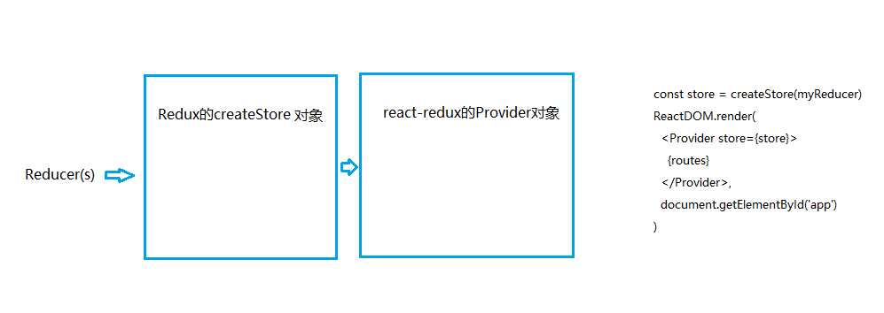

React和Redux如何建立联系？

 

首先，Reducer管理着状态：

	const initialState = {
	  name: '',
	  isLoading: false
	}
	function reducer (state = initialState, action) {
	  switch (action.type) {
	    case 'SUBMIT_USER' :
	      return Object.assign({}, state, {
	        name: action.user
	      })
	    case 'CHANGE_LOADING' :
	      return Object.assign({}, state, {
	        isLoading: action.loading
	      })
	    default : 
	      return state
	  }
	}

 

redux的createStore对象用来管理状态：

	import { createStore } from 'redux'
	import myReducer from '../reducer'
	const store = createStore(myReducer)

 

React和Redux之间建立联系还要依靠react-redux的Provider对象：

	import { Provider } from 'react-redux'
	import myReducer from '../reducer'
	.
	.
	.
	const store = createStore(myReducer)
	ReactDOM.render(
	  <Provider store={store}>
	    {routes}
	  </Provider>,
	  document.getElementById('app')
	)

 

big picture大致是：

