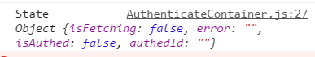

如何把AuthenticateContainer这个容器组件与redux连接起来呢？

 

> app/containers/Authenticate/AuthenticateContainer.js

 

	import React, { PropTypes } from 'react'
	import { Authenticate } from 'components'
	import auth from 'helpers/auth'
	import { connect } from 'react-redux'
	
	const AuthenticateContainer = React.createClass({
	  propTypes: {
	    isFetching: PropTypes.bool.isRequired,
	    error: PropTypes.string.isRequired
	  },
	  handleAuth () {
	    auth().then((user) => {
	      console.log(user)
	    })
	  },
	  render () {
	    return (
	      <Authenticate
	        onAuth={this.handleAuth}
	        isFetching={false}
	        error={''} />
	    )
	  },
	})
	
	function mapStateToProps(state){
	    console.log('State', state)
	    return {}
	}
	
	export default connect(mapStateToProps)(AuthenticateContainer)

 

> localhost:8080

 
来到验证路由的页面

 

完善一下就是：

> app/containers/Authenticate/AuthenticateContainer.js

 

如何把AuthenticateContainer这个容器组件与redux连接起来呢？

 

> app/containers/Authenticate/AuthenticateContainer.js

 

	import React, { PropTypes } from 'react'
	import { Authenticate } from 'components'
	import auth from 'helpers/auth'
	import { connect } from 'react-redux'
	
	const AuthenticateContainer = React.createClass({
	  propTypes: {
	    isFetching: PropTypes.bool.isRequired,
	    error: PropTypes.string.isRequired
	  },
	  handleAuth () {
	    auth().then((user) => {
	      console.log(user)
	    })
	  },
	  render () {
	    return (
	      <Authenticate
	        onAuth={this.handleAuth}
	        isFetching={false}
	        error={''} />
	    )
	  },
	})
	
	function mapStateToProps(state){
	    console.log('State', state)
	    return {}
	}
	
	export default connect(mapStateToProps)(AuthenticateContainer)

 

> localhost:8080

 
来到验证路由的页面

 

完善一下就是：

> app/containers/Authenticate/AuthenticateContainer.js

 

    import React, { PropTypes } from 'react'
    import { Authenticate } from 'components'
    import auth from 'helpers/auth'
    import { connect } from 'react-redux'

    const AuthenticateContainer = React.createClass({
      propTypes: {
        isFetching: PropTypes.bool.isRequired,
        error: PropTypes.string.isRequired
      },
      handleAuth () {
        auth().then((user) => {
          console.log(user)
        })
      },
      render () {
        return (
          <Authenticate
            onAuth={this.handleAuth}
            isFetching={this.props.isFetching}
            error={this.props.error} />
        )
      },
    })

    function mapStateToProps(state){
        return {
            isFetching: state.isFetching,
            error: state.error
        }
    }

    export default connect(mapStateToProps)(AuthenticateContainer)