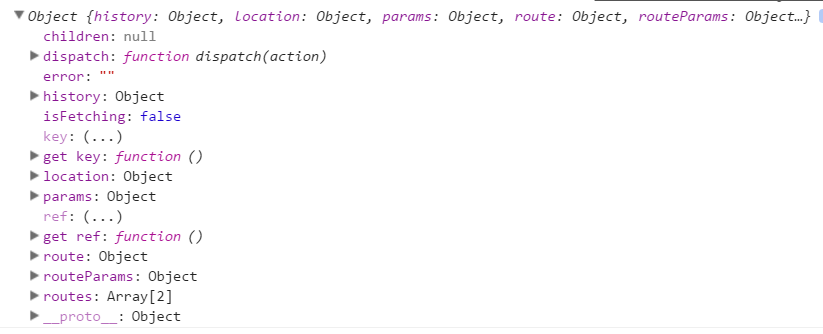

> app/containers/Authenticate/AuthenticateContainer.js

 

	import React, { PropTypes } from 'react'
	import { Authenticate } from 'components'
	import auth from 'helpers/auth'
	import { connect } from 'react-redux'
	
	const AuthenticateContainer = React.createClass({
	  propTypes: {
	    isFetching: PropTypes.bool.isRequired,
	    error: PropTypes.string.isRequired
	  },
	  handleAuth () {
	    auth().then((user) => {
	      console.log(user)
	    })
	  },
	  render () {
	    console.log(this.props)
	    return (
	      <Authenticate
	        onAuth={this.handleAuth}
	        isFetching={this.props.isFetching}
	        error={this.props.error} />
	    )
	  },
	})
	
	function mapStateToProps(state){
	    return {
	        isFetching: state.isFetching,
	        error: state.error
	    }
	}
	
	export default connect(mapStateToProps)(AuthenticateContainer)
在render方法中，把this.props属性打印出来。

 

> localhost:8080

 
来到相关页面

 

 

以上，dispatch,isFetching, error来自redux.

