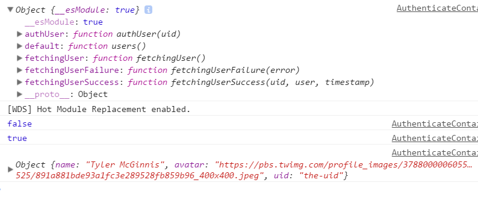

在上一节发现了：一旦组件与redux连接起来，组件的this.props属性中会有一个dispatch对象，这是redux给到我们的。我们可以借此来手动调用Action中的某个方法。

 

> app/containers/Authenticate/AuthenticateContainer.js

 

	import React, { PropTypes } from 'react'
	import { Authenticate } from 'components'
	import auth from 'helpers/auth'
	import { connect } from 'react-redux'
	import * as userActionCreators from 'redux/modules/users'
	
	console.log(userActionCreators)
	
	const AuthenticateContainer = React.createClass({
	  propTypes: {
	    isFetching: PropTypes.bool.isRequired,
	    error: PropTypes.string.isRequired
	  },
	  handleAuth () {
	    this.props.dispatch(userActionCreators.fetchingUser())
	    auth().then((user) => {
	      console.log(user)
	    })
	  },
	  render () {
	    console.log(this.props.isFetching)
	    return (
	      <Authenticate
	        onAuth={this.handleAuth}
	        isFetching={this.props.isFetching}
	        error={this.props.error} />
	    )
	  },
	})
	
	function mapStateToProps(state){
	    return {
	        isFetching: state.isFetching,
	        error: state.error
	    }
	}
	
	export default connect(mapStateToProps)(AuthenticateContainer)

- 通过`console.log(userActionCreators)`把Action中的所有方法打印了出来
- `this.props.dispatch(userActionCreators.fetchingUser())`是在手动调用Action中的fetchingUser方法

 

> http://localhost:8080/#/auth?_k=j6gfyy

 
点击"Login with facebook"按钮。

 

