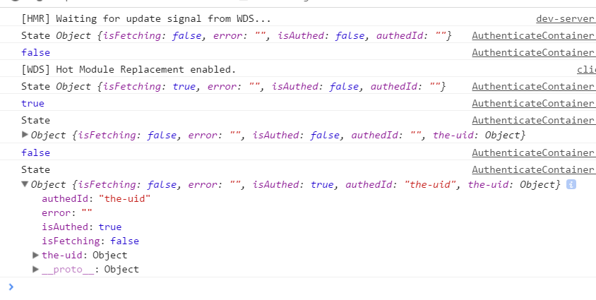

在上一节中，通过组件的dispatch方法来手动调用Action的方法，这固然很好，但有时候，我们还希望：在组件中直接调用Actiong方法，类似`userActionCreators.fetchingUserSuccess`这样的方式来调用，不通过dispatch了。也就是组件调用Action的方法就像调用自己的本身的方法一样。如何做呢？

 

> app/containers/Authenticate/AuthenticateContainer.js

 

	import React, { PropTypes } from 'react'
	import { Authenticate } from 'components'
	import auth from 'helpers/auth'
	import { connect } from 'react-redux'
	import { bindActionCreators } from 'redux'
	import * as userActionCreators from 'redux/modules/users'
	
	
	const AuthenticateContainer = React.createClass({
	  propTypes: {
	    isFetching: PropTypes.bool.isRequired,
	    error: PropTypes.string.isRequired,
	    authUser: PropTypes.func.isRequired,
	    fetchingUser: PropTypes.func.isRequired,
	    fetchingUserSuccess: PropTypes.func.isRequired,
	    fetchingUserFailure: PropTypes.func.isRequired
	  },
	  handleAuth () {
	    this.props.fetchingUser()
	    auth().then((user) => {
	      this.props.fetchingUserSuccess(user.uid, user, Date.now())
	      this.props.authUser(user.uid)
	    })
	    .catch((error) => this.props.fetchingUserFailure(error))
	  },
	  render () {
	    console.log(this.props.isFetching)
	    return (
	      <Authenticate
	        onAuth={this.handleAuth}
	        isFetching={this.props.isFetching}
	        error={this.props.error} />
	    )
	  },
	})
	
	function mapStateToProps(state){
	    console.log('State', state)
	    return {
	        isFetching: state.isFetching,
	        error: state.error
	    }
	}
	
	function mapDispatchToProps(dispatch){
	    return bindActionCreators(userActionCreators, dispatch)
	}
	
	export default connect(mapStateToProps, mapDispatchToProps)(AuthenticateContainer)

 

> http://localhost:8080/#/auth?_k=yfwlwv

 

