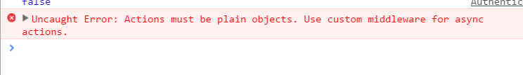

> app/containers/Authenticate/AuthenticateContainer.js

 

其中有这样的一段代码：

	  handleAuth () {
	    this.props.fetchingUser()
	    auth().then((user) => {
	      this.props.fetchingUserSuccess(user.uid, user, Date.now())
	      this.props.authUser(user.uid)
	    })
	    .catch((error) => this.props.fetchingUserFailure(error))
	  },

 

是否可以简化成一段代码呢？是否可以放到ActionCreator那里呢？

	this.props.fetchAndHandleAuthedUser()

 

> app/redux/modules/users.js

 

	import auth from 'helpers/auth'
	
	const AUTH_USER = 'AUTH_USER'
	const UNAUTH_USER = 'UNAUTH_USER'
	const FETCHING_USER = 'FETCHING_USER'
	const FETCHING_USER_FAILURE = 'FETCHING_USER_FAILURE'
	const FETCHING_USER_SUCCESS = 'FETCHING_USER_SUCCESS'
	
	function authUser (uid) {
	  return {
	    type: AUTH_USER,
	    uid,
	  }
	}
	
	function unauthUser () {
	  return {
	    type: UNAUTH_USER,
	  }
	}
	
	function fetchingUser () {
	  return {
	    type: FETCHING_USER,
	  }
	}
	
	function fetchingUserFailure (error) {
	  console.warn(error)
	  return {
	    type: FETCHING_USER_FAILURE,
	    error: 'Error fetching user.',
	  }
	}
	
	function fetchingUserSuccess (uid, user, timestamp) {
	  return {
	    type: FETCHING_USER_SUCCESS,
	    uid,
	    user,
	    timestamp,
	  }
	}
	
	export function fetchAndHandleAuthedUser(){
	  return function (dispatch) {
	    dispatch(fetchingUser())
	    return auth()
	      .then((user) => dispatch(fetchingUserSuccess(user.uid, user, Date.now())))
	      .then((user) => dispatch(authUser(user.uid)))
	      .catch((error) => dispatch(fetchingUserFailure(error)))
	  }
	}
	
	const initialUserState = {
	  lastUpdated: 0,
	  info: {
	    name: '',
	    uid: '',
	    avatar: '',
	  },
	}
	
	function user (state = initialUserState, action) {
	  switch (action.type) {
	    case FETCHING_USER_SUCCESS :
	      return {
	        ...state,
	        info: action.user,
	        lastUpdated: action.timestamp,
	      }
	    default :
	      return state
	  }
	}
	
	const initialState = {
	  isFetching: false,
	  error: '',
	  isAuthed: false,
	  authedId: '',
	}
	
	export default function users (state = initialState, action) {
	  switch (action.type) {
	    case AUTH_USER :
	      return {
	        ...state,
	        isAuthed: true,
	        authedId: action.uid,
	      }
	    case UNAUTH_USER :
	      return {
	        ...state,
	        isAuthed: false,
	        authedId: '',
	      }
	    case FETCHING_USER:
	      return {
	        ...state,
	        isFetching: true,
	      }
	    case FETCHING_USER_FAILURE:
	      return {
	        ...state,
	        isFetching: false,
	        error: action.error,
	      }
	    case FETCHING_USER_SUCCESS:
	      return action.user === null
	        ? {
	          ...state,
	          isFetching: false,
	          error: '',
	        }
	        : {
	          ...state,
	          isFetching: false,
	          error: '',
	          [action.uid]: user(state[action.uid], action),
	        }
	    default :
	      return state
	  }
	}

 
> app/containers/Authenticate/AuthenticateContainer.js

 

	import React, { PropTypes } from 'react'
	import { Authenticate } from 'components'
	
	import { connect } from 'react-redux'
	import { bindActionCreators } from 'redux'
	import * as userActionCreators from 'redux/modules/users'
	
	
	const AuthenticateContainer = React.createClass({
	  propTypes: {
	    isFetching: PropTypes.bool.isRequired,
	    error: PropTypes.string.isRequired,
	    fetchAndHandleAuthedUser: PropTypes.func.isRequired
	  },
	  handleAuth () {
	    this.props.fetchAndHandleAuthedUser()
	  },
	  render () {
	    console.log(this.props.isFetching)
	    return (
	      <Authenticate
	        onAuth={this.handleAuth}
	        isFetching={this.props.isFetching}
	        error={this.props.error} />
	    )
	  },
	})
	
	function mapStateToProps(state){
	    console.log('State', state)
	    return {
	        isFetching: state.isFetching,
	        error: state.error
	    }
	}
	
	function mapDispatchToProps(dispatch){
	    return bindActionCreators(userActionCreators, dispatch)
	}
	
	export default connect(mapStateToProps, mapDispatchToProps)(AuthenticateContainer)

 

> http://localhost:8080/#/auth?_k=autcuh

 

点击"Login with facebook"发生如下错误：

这个报错告诉我们，在action和reducer之间需要一个middleware.

 
redux-thunk就此登场。

> npm install --save redux-thunk

 

在路口文件中配置接受中间价
> app/index.js

 

	import ReactDOM from 'react-dom'
	import React from 'react'
	import routes from './config/routes'
	import { createStore, applyMiddleware } from 'redux'
	import users from 'redux/modules/users'
	import { Provider } from 'react-redux'
	import thunk from 'redux-thunk'    
	
	const store = createStore(users, applyMiddleware(thunk))
	
	ReactDOM.render(
	    <Provider store={store}>
	        {routes}
	    </Provider>,
	    document.getElementById('app')
	)

 

> http://localhost:8080/#/auth?_k=autcuh

 

