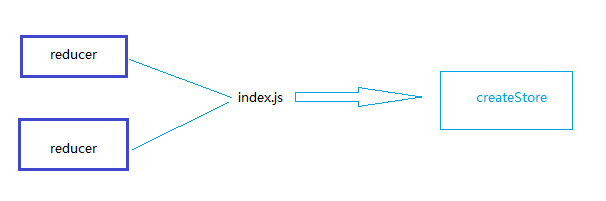
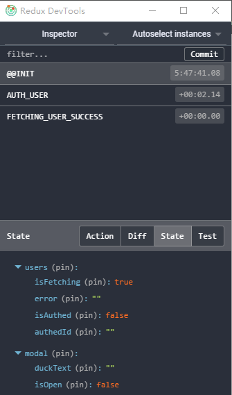

现在，在app/redux/modules/users.js中，有关有关user的action, reducer, state。如果我们要创建一个有关模态的modal.js,里面也会有action, reducer和state.这一节，我们让所有的reducer合并到一处，然后交个createStore.

 

> npm install --save react-modal

 

先来一个有关模态窗口的reducer
> app/redux/modules/modal.js
	
 
	
	
	const OPEN_MODAL = 'OPEN_MODAL'
	const CLOSE_MODAL = 'CLOSE_MODAL'
	const UPDATE_DUCK_TEXT = 'UPDATE_DUCK_TEXT'
	
	export function openModal () {
	  return {
	    type: OPEN_MODAL,
	  }
	}
	
	export function closeModal () {
	  return {
	    type: CLOSE_MODAL,
	  }
	}
	
	export function updateDuckText (newDuckText) {
	  return {
	    type: UPDATE_DUCK_TEXT,
	    newDuckText,
	  }
	}
	
	const initialState = {
	  duckText: '',
	  isOpen: false,
	}
	
	export default function modal (state = initialState, action) {
	  switch (action.type) {
	    case OPEN_MODAL :
	      return {
	        ...state,
	        isOpen: true,
	      }
	    case CLOSE_MODAL :
	      return {
	        duckText: '',
	        isOpen: false,
	      }
	    case UPDATE_DUCK_TEXT :
	      return {
	        ...state,
	        duckText: action.newDuckText,
	      }
	    default :
	      return state
	  }
	}

 

再来一个管理reducer的index.js

> app/redux/modules/index.js

 
	
	export users from './users'
	export modal from './modal'

 

> app/index.js

 

	import React from 'react'
	import ReactDOM from 'react-dom'
	import getRoutes from 'config/routes'
	import users from 'redux/modules/users'
	import thunk from 'redux-thunk'
	import { createStore, applyMiddleware, compose, combineReducers } from 'redux'
	import { Provider } from 'react-redux'
	import { checkIfAuthed } from 'helpers/auth'
	import * as reducers from 'redux/modules'    
	
	const store = createStore(
	  combineReducers(reducers),
	  compose(
	    applyMiddleware(thunk),
	    window.devToolsExtension ? window.devToolsExtension() : (f) => f
	  )
	)
	
	function checkAuth (nextState, replace) {
	  if (store.getState().isFetching === true) {
	    return
	  }
	
	  const isAuthed = checkIfAuthed(store)
	  const nextPathName = nextState.location.pathname
	  if (nextPathName === '/' || nextPathName === '/auth') {
	    if (isAuthed === true) {
	      replace('/feed')
	    }
	  } else {
	    if (isAuthed !== true) {
	      replace('/auth')
	    }
	  }
	}
	
	ReactDOM.render(
	  <Provider store={store}>
	    {getRoutes(checkAuth)}
	  </Provider>,
	document.getElementById('app'))

 

> localhost:8080

 

