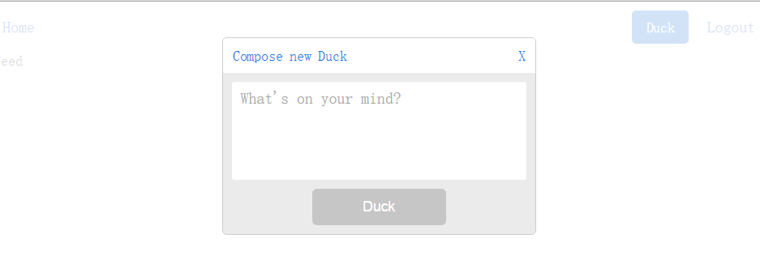

关于模态窗口，肯定是一个表现组件和容器组件，容器组件用connect包裹起来和redux进行连接。

 
首先是表现组件。
> app/components/Modal/Modal.js

 

	import React, { PropTypes } from 'react'
	import { default as ReactModal } from 'react-modal'
	import {
	  newDuckTop, pointer, newDuckInputContainer,
	  newDuckInput, submitDuckBtn, darkBtn } from './styles.css'
	
	const modalStyles = {
	  content: {
	    width: 350,
	    margin: '0px auto',
	    height: 220,
	    borderRadius: 5,
	    background: '#EBEBEB',
	    padding: 0,
	  },
	}
	
	const { object, string, func, bool } = PropTypes
	Modal.propTypes = {
	  duckText: string.isRequired,
	  closeModal: func.isRequired,
	  isOpen: bool.isRequired,
	  isSubmitDisabled: bool.isRequired,
	  openModal: func.isRequired,
	  updateDuckText: func.isRequired,
	  user: object.isRequired,
	}
	
	export default function Modal (props) {
	  function submitDuck () {
	    console.log('Duck', props.duckText)
	    console.log('user', props.user)
	  }
	
	  return (
	    
	      {'Duck'}
	      <ReactModal style={modalStyles} isOpen={props.isOpen} onRequestClose={props.closeModal}>
	        

	          {'Compose new Duck'}
	          {'X'}
	        

	        

	          <textarea
	            onChange={(e) => props.updateDuckText(e.target.value)}
	            value={props.duckText}
	            maxLength={140}
	            type='text'
	            className={newDuckInput}
	            placeholder="What's on your mind?" />
	        

	        <button
	          className={submitDuckBtn}
	          disabled={props.isSubmitDisabled}
	          onClick={submitDuck}>
	            {'Duck'}
	        </button>
	      </ReactModal>
	    
	  )
	}

- 当点击Duck的时候，就触发props.openModal方法，当容器组件中使用connect与reudux的createStore进行连接后，表现组件就会有props.openModal这个方法，也就是Action,然后让reducer更改状态
- 更改的状态满足某种条件，表现组件里的ReactModal就打开了
- ReactModal中有一个props.closeModal，Action同样可以给到
- ReactModal中有一个props.updateDuckText，Action同样可以给到
- ReactModal中的props.duckText可以到状态中获取
- ReactModal的props.isSubmitDisabled也可以到状态中获取

 
这个模态窗口的表现组件也有样式设置。
> app/componets/Modal/styles.css

 

	.newDuckTop {
	  background: #fff;
	  padding: 11px;
	  display: flex;
	  justify-content: space-between;
	  align-items: center;
	  color: #1877E6;
	}
	
	.pointer {
	  cursor: pointer;
	}
	
	.newDuckInputContainer {
	  composes: baseTextAreaContainer from 'sharedStyles/styles.css';
	}
	
	.newDuckInput {
	  composes: baseTextArea from 'sharedStyles/styles.css';
	  border-width: 0;
	}
	
	.darkBtn {
	  composes: darkBtn from 'sharedStyles/styles.css';
	  text-decoration: none;
	}
	
	.submitDuckBtn {
	  composes: darkBtn;
	  margin: 0px auto;
	  width: 150px;
	  text-align: center;
	  display: block;
	}
	
	.submitDuckBtn:disabled {
	  background: #C6C6C6;
	  border: 1px solid #C6C6C6;
	}

 

当然，模态窗口的表现组件也被index.js管理。
> app/components/index.js

 

	export Home from './Home/Home'
	export Navigation from './Navigation/Navigation'
	export Authenticate from './Authenticate/Authenticate'
	export FacebookAuthButton from './FacebookAuthButton/FacebookAuthButton'
	export Feed from './Feed/Feed'
	export Logout from './Logout/Logout'
	export Modal from './Modal/Modal'

 

模态窗口的容器组件就负责和redux连接。
> app/containers/Modal/ModalContainer.js

 

	import { bindActionCreators } from 'redux'
	import { connect } from 'react-redux'
	import { Modal } from 'components'
	import * as modalActionCreators from 'redux/modules/modal'
	
	function mapStateToProps ({modal, users}, props) {
	  const duckTextLength = modal.duckText.length
	  return {
	    user: users[users.authedId] ? users[users.authedId].info : {},
	    duckText: modal.duckText,
	    isOpen: modal.isOpen,
	    isSubmitDisabled: duckTextLength <= 0 || duckTextLength > 140,
	  }
	}
	function mapDispatchToProps (dispatch, props) {
	  return bindActionCreators(modalActionCreators, dispatch)
	}
	
	export default connect(
	  mapStateToProps,
	  mapDispatchToProps
	)(Modal)

 

这个容器组件也是需要被index.js管理的。
> app/containers/index.js

 

	export MainContainer from './Main/MainContainer'
	export HomeContainer from './Home/HomeContainer'
	export AuthenticateContainer from './Authenticate/AuthenticateContainer'
	export FeedContainer from './Feed/FeedContainer'
	export LogoutContainer from './Logout/LogoutContainer'
	export ModalContainer from './Modal/ModalContainer'

 

然后就是导航菜单组件里用到了模态窗口的容器组件。
> app/components/Navigation/Navigation.js

 

	import React, { PropTypes } from 'react'
	import { Link } from 'react-router'
	import { ModalContainer } from 'containers'
	import { container, navContainer, link } from './styles.css'
	
	Navigation.propTypes = ActionLinks.propTypes = NavLinks.propTypes = {
	  isAuthed: PropTypes.bool.isRequired,
	}
	
	function NavLinks ({isAuthed}) {
	  return isAuthed === true
	    ? <ul>
	        <li><Link to='/' className={link}>{'Home'}</Link></li>
	      </ul>
	    : null
	}
	
	function ActionLinks ({isAuthed}) {
	  return isAuthed === true
	    ? <ul>
	        <li><ModalContainer /></li>
	        <li><Link to='/logout' className={link}>{'Logout'}</Link></li>
	      </ul>
	    : <ul>
	        <li><Link to='/' className={link}>{'Home'}</Link></li>
	        <li><Link to='/auth' className={link}>{'Authenticate'}</Link></li>
	      </ul>
	}
	
	export default function Navigation ({isAuthed}) {
	  return (
	    

	      <nav className={navContainer}>
	        <NavLinks isAuthed={isAuthed} />
	        <ActionLinks isAuthed={isAuthed} />
	      </nav>
	    

	  )
	}

 

最后，就是导航菜单组件被MainContainer这个组件用到了。
> app/containers/Main/MainContainer.js

 

	import React, { PropTypes } from 'react'
	import { connect } from 'react-redux'
	import { Navigation } from 'components'
	import { container, innerContainer } from './styles.css'
	import { bindActionCreators } from 'redux'
	import * as userActionCreators from 'redux/modules/users'
	import { formatUserInfo } from 'helpers/utils'
	import { firebaseAuth } from 'config/constants'
	
	const MainContainer = React.createClass({
	  propTypes: {
	    isAuthed: PropTypes.bool.isRequired,
	    authUser: PropTypes.func.isRequired,
	    fetchingUserSuccess: PropTypes.func.isRequired,
	    removeFetchingUser: PropTypes.func.isRequired,
	  },
	  contextTypes: {
	    router: PropTypes.object.isRequired,
	  },
	  componentDidMount () {
	    firebaseAuth().onAuthStateChanged((user) => {
	      if (user) {
	        const userData = user.providerData[0]
	        const userInfo = formatUserInfo(userData.displayName, userData.photoURL, user.uid)
	        this.props.authUser(user.uid)
	        this.props.fetchingUserSuccess(user.uid, userInfo, Date.now())
	        if (this.props.location.pathname === '/') {
	          this.context.router.replace('feed')
	        }
	      } else {
	         this.props.removeFetchingUser()
	      }
	    })
	  },
	  render () {
	    return this.props.isFetching === true
	      ? null
	      : 

	          <Navigation isAuthed={this.props.isAuthed} />
	          

	            {this.props.children}
	          

	        

	  },
	})
	
	export default connect(
	  ({users}) => ({isAuthed: users.isAuthed, isFetching: users.isFetching}),
	  (dispatch) => bindActionCreators(userActionCreators, dispatch)
	)(MainContainer)

