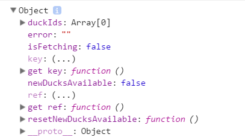

首先是有关feed的reducer
> app/redux/modules/listeners.js

 

	const ADD_LISTENER = 'ADD_LISTENER'
	
	export function addListener (listenerId) {
	  return {
	    type: ADD_LISTENER,
	    listenerId,
	  }
	}
	
	export default function listeners (state = {}, action) {
	  switch (action.type) {
	    case ADD_LISTENER :
	      return {
	        ...state,
	        [action.listenerId]: true,
	      }
	    default :
	      return state
	  }
	}

 

被index.js管理
> app/redux/modules/index.js

 

	export users from './users'
	export modal from './modal'
	export ducks from './ducks'
	export usersDucks from './usersDucks'
	export feed from './feed'
	export listeners from './listeners'

 

其它的reducer
> app/redux/modules/feed.js

 

	import { addListener } from 'redux/modules/listeners'
	import { listenToFeed } from 'helpers/api'
	import { addMultipleDucks } from 'redux/modules/ducks'
	
	const SETTING_FEED_LISTENER = 'SETTING_FEED_LISTENER'
	const SETTING_FEED_LISTENER_ERROR = 'SETTING_FEED_LISTENER_ERROR'
	const SETTING_FEED_LISTENER_SUCCESS = 'SETTING_FEED_LISTENER_SUCCESS'
	const ADD_NEW_DUCK_ID_TO_FEED = 'ADD_NEW_DUCK_ID_TO_FEED'
	const RESET_NEW_DUCKS_AVAILABLE = 'RESET_NEW_DUCKS_AVAILABLE'
	
	function settingFeedListener () {
	  return {
	    type: SETTING_FEED_LISTENER,
	  }
	}
	
	function settingFeedListenerError (error) {
	  console.warn(error)
	  return {
	    type: SETTING_FEED_LISTENER_ERROR,
	    error: 'Error fetching feeds.',
	  }
	}
	
	function settingFeedListenerSuccess (duckIds) {
	  return {
	    type: SETTING_FEED_LISTENER_SUCCESS,
	    duckIds,
	  }
	}
	
	
	function addNewDuckIdToFeed (duckId) {
	  return {
	    type: ADD_NEW_DUCK_ID_TO_FEED,
	    duckId,
	  }
	}
	
	export function resetNewDucksAvailable () {
	  return {
	    type: RESET_NEW_DUCKS_AVAILABLE,
	  }
	}
	
	export function setAndHandleFeedListener () {
	  let initialFetch = true
	  return function (dispatch, getState) {
	    if (getState().listeners.feed === true) {
	      return
	    }
	
	    dispatch(addListener('feed'))
	    dispatch(settingFeedListener())
	    listenToFeed(({feed, sortedIds}) => {
	      dispatch(addMultipleDucks(feed))
	      initialFetch === true
	        ? dispatch(settingFeedListenerSuccess(sortedIds))
	        : dispatch(addNewDuckIdToFeed(sortedIds[0]))
	      initialFetch = false
	    }, (error) => dispatch(settingFeedListenerError(error)))
	  }
	}
	
	const initialState = {
	  newDucksAvailable: false,
	  newDucksToAdd: [],
	  isFetching: false,
	  error: '',
	  duckIds: [],
	}
	
	export default function feed (state = initialState, action) {
	  switch (action.type) {
	    case SETTING_FEED_LISTENER :
	      return {
	        ...state,
	        isFetching: true,
	      }
	    case SETTING_FEED_LISTENER_ERROR :
	      return {
	        ...state,
	        isFetching: false,
	        error: action.error,
	      }
	    case SETTING_FEED_LISTENER_SUCCESS :
	      return {
	        ...state,
	        isFetching: false,
	        error: '',
	        duckIds: action.duckIds,
	        newDucksAvailable: false,
	      }
	    case ADD_NEW_DUCK_ID_TO_FEED :
	      return {
	        ...state,
	        newDucksToAdd: [action.duckId, ...state.newDucksToAdd],
	        newDucksAvailable: true,
	      }
	    case RESET_NEW_DUCKS_AVAILABLE :
	      return {
	        ...state,
	        duckIds: [...state.newDucksToAdd, ...state.duckIds],
	        newDucksToAdd: [],
	        newDucksAvailable: false,
	      }
	    default :
	      return state
	  }
	}

 

> app/redux/modules/ducks.js

 

	import { saveDuck } from 'helpers/api'
	import { closeModal } from './modal'
	import { addSingleUsersDuck } from './usersDucks'
	
	const FETCHING_DUCK = 'FETCHING_DUCK'
	const FETCHING_DUCK_ERROR = 'FETCHING_DUCK_ERROR'
	const FETCHING_DUCK_SUCCESS = 'FETCHING_DUCK_SUCCESS'
	const ADD_DUCK = 'ADD_DUCK'
	const ADD_MULTIPLE_DUCKS = 'ADD_MULTIPLE_DUCKS'
	const REMOVE_FETCHING = 'REMOVE_FETCHING'
	
	function fetchingDuck () {
	  return {
	    type: FETCHING_DUCK,
	  }
	}
	
	function fetchingDuckError (error) {
	  console.warn(error)
	  return {
	    type: FETCHING_DUCK_ERROR,
	    error: 'Error fetching Duck',
	  }
	}
	
	function fetchingDuckSuccess (duck) {
	  return {
	    type: FETCHING_DUCK_SUCCESS,
	    duck,
	  }
	}
	
	function removeFetching () {
	  return {
	    type: REMOVE_FETCHING,
	  }
	}
	
	function addDuck (duck) {
	  return {
	    type: ADD_DUCK,
	    duck,
	  }
	}
	
	export function addMultipleDucks (ducks) {
	  return {
	    type: ADD_MULTIPLE_DUCKS,
	    ducks,
	  }
	}
	
	export function duckFanout (duck) {
	  return function (dispatch, getState) {
	    const uid = getState().users.authedId
	    saveDuck(duck)
	      .then((duckWithID) => {
	        dispatch(addDuck(duckWithID))
	        dispatch(closeModal())
	        dispatch(addSingleUsersDuck(uid, duckWithID.duckId))
	      })
	      .catch((err) => {
	        console.warn('Error in duckFanout', err)
	      })
	  }
	}
	
	const initialState = {
	  isFetching: true,
	  error: '',
	}
	
	export default function ducks (state = initialState, action) {
	  switch (action.type) {
	    case FETCHING_DUCK :
	      return {
	        ...state,
	        isFetching: true,
	      }
	    case ADD_DUCK :
	    case FETCHING_DUCK_SUCCESS :
	      return {
	        ...state,
	        error: '',
	        isFetching: false,
	        [action.duck.duckId]: action.duck,
	      }
	    case FETCHING_DUCK_ERROR :
	      return {
	        ...state,
	        isFetching: false,
	        error: action.error,
	      }
	    case REMOVE_FETCHING :
	      return {
	        ...state,
	        error: '',
	        isFetching: false,
	      }
	    case ADD_MULTIPLE_DUCKS :
	      return {
	        ...state,
	        ...action.ducks,
	      }
	    default :
	      return state
	  }
	}

 

变现组件
> app/components/Feed/Feed.js

 

	import React, { PropTypes } from 'react'
	
	export default function Feed(props){
	    console.log(props)
	    return (
	        
Feed

	    )
	}

 

容器组件
> app/containers/Feed/FeedContainer.js

 

	import React, { PropTypes } from 'react'
	import { connect } from 'react-redux'
	import { Feed } from 'components'
	import { bindActionCreators } from 'redux'
	import * as feedActionCreators from 'redux/modules/feed'
	
	const FeedContainer = React.createClass({
	  propTypes: {
	    duckIds: PropTypes.array.isRequired,
	    newDucksAvailable: PropTypes.bool.isRequired,
	    error: PropTypes.string.isRequired,
	    isFetching: PropTypes.bool.isRequired,
	    setAndHandleFeedListener: PropTypes.func.isRequired,
	    resetNewDucksAvailable: PropTypes.func.isRequired,
	  },
	  componentDidMount () {
	    this.props.setAndHandleFeedListener()
	  },
	  render () {
	    return (
	      <Feed
	        duckIds={this.props.duckIds}
	        newDucksAvailable={this.props.newDucksAvailable}
	        error={this.props.error}
	        isFetching={this.props.isFetching}
	        resetNewDucksAvailable={this.props.resetNewDucksAvailable} />
	    )
	  },
	})
	
	function mapStateToProps ({feed}) {
	  const { newDucksAvailable, error, isFetching, duckIds } = feed
	  return {
	    newDucksAvailable,
	    error,
	    isFetching,
	    duckIds,
	  }
	}
	
	export default connect(
	  mapStateToProps,
	  (dispatch) => bindActionCreators(feedActionCreators, dispatch)
	)(FeedContainer)

 

> http://localhost:8080/#/feed?_k=ug09q6

 

